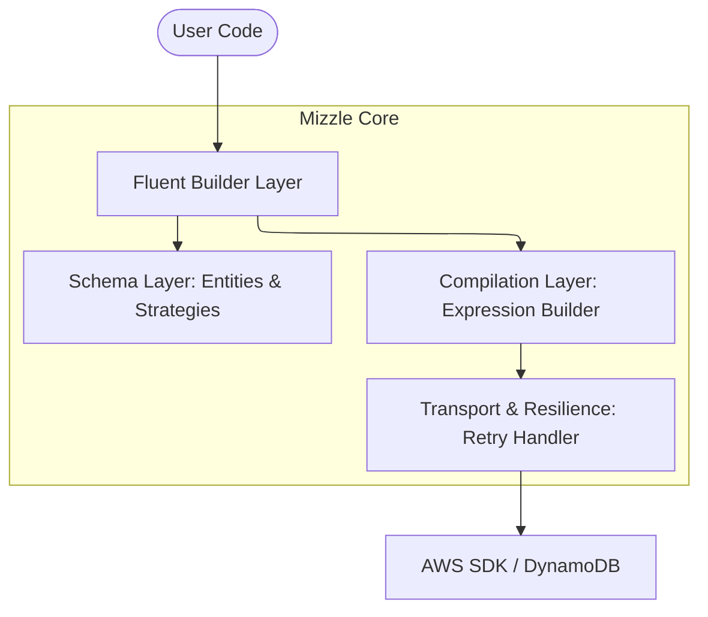
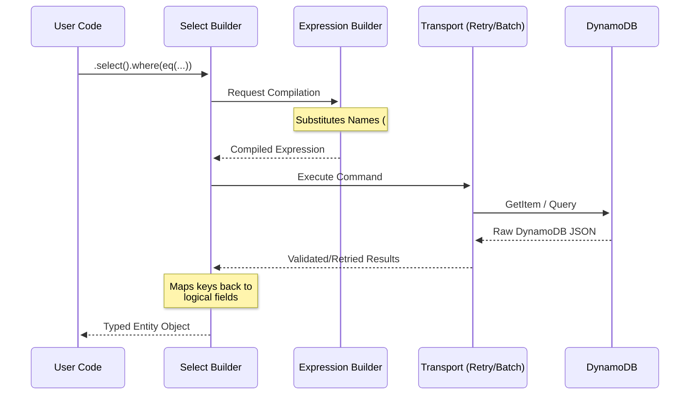

Mizzle is designed as a modular, type-safe abstraction layer over the AWS SDK for DynamoDB. It focuses on developer ergonomics without sacrificing the performance or flexibility of the underlying database.

## System Architecture

Mizzle's architecture can be visualized in four primary layers:

1.  **Schema Layer:** Defines the structure of your data.
2.  **Fluent Builder Layer:** Provides the public API for operations.
3.  **Compilation Layer:** Transforms high-level queries into DynamoDB expressions.
4.  **Transport & Resilience Layer:** Handles network requests and error recovery.

### 1. Schema Layer

At the heart of Mizzle are your **Table** and **Entity** definitions.

- **`PhysicalTable`**: Represents the actual DynamoDB table (name, primary keys, GSIs).
- **`Entity`**: A logical view of data within a table. This is where you define columns and "Key Strategies".
- **Key Strategies**: These bridge the gap between logical fields (e.g., `userId`) and physical keys (e.g., `pk: "USER#123"`).

### 2. Fluent Builder Layer

The API you interact with (e.g., `db.select()`, `db.insert()`) returns **Builders**.
Builders are stateful objects that accumulate configuration (filters, values, consistency settings). They implement the `Promise` interface, so they can be awaited directly, triggering the execution, so no need to `.execute()` everywhere.

### 3. Compilation Layer (Internals)

When a builder is executed, it passes its state to the **Expression Builder**.
This internal engine performs several critical tasks:

- **Name Substitution**: Replaces attribute names with placeholders (`#n0`, `#n1`) to avoid conflicts with DynamoDB reserved words.
- **Value Substitution**: Maps JavaScript values to attribute value placeholders (`:v0`, `:v1`).
- **String Generation**: Generates the final `FilterExpression`, `KeyConditionExpression`, or `UpdateExpression`.

### 4. Transport Layer

Mizzle wraps the standard `DynamoDBDocumentClient`. It adds a **Resilience Layer** that provides:

- **Exponential Backoff**: Automatic retries for throttling and transient server errors.
- **Partial Batch Handling**: Transparently retries "Unprocessed Items" in batch operations until the entire batch is complete or the retry limit is reached.

## Data Flow Example: `db.select()`

1.  **User Call**: `db.select().from(users).where(eq(users.id, '123'))`
2.  **Strategy Resolution**: Mizzle identifies that `users.id` corresponds to the Partition Key. It prepares a `GetItem` or `Query` command.
3.  **Expression Compilation**: The `eq` operator is compiled into a condition string.
4.  **Mapping**: Logical property names in the returned data are mapped back to your TypeScript entity structure.
5.  **Return**: The user receives a typed JavaScript object.

